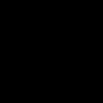
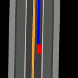
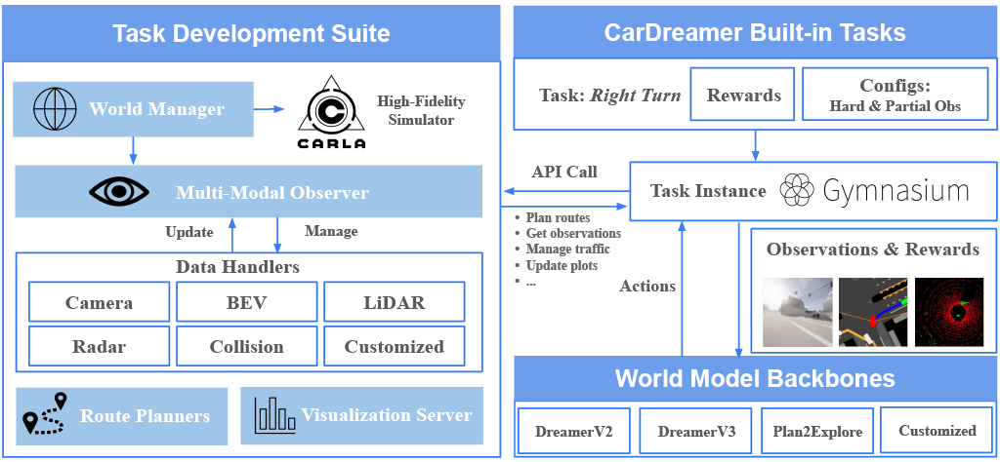

# 🌍 Learn to Drive in "Dreams": CarDreamer 🚗

<div align="center">
    <a href="https://huggingface.co/ucd-dare/CarDreamer/tree/main">
        
        HuggingFace Checkpoints
    </a>
    &nbsp;|&nbsp;
    <a href="https://car-dreamer.readthedocs.io/en/latest/">
        
        CarDreamer API Documents
    </a>
    &nbsp;|&nbsp;
    <a href="https://arxiv.org/abs/2405.09111">
        
        ArXiv Pre-print
    </a>
    <a href="https://ucd-dare.github.io/cardreamer.github.io/">
        
        Project Page
    </a>

</div>

---


Unleash the power of **imagination** and **generalization** of world models for self-driving cars.

> [!NOTE]
> - **July 2024:** Created a stop-sign task and a traffic-light task!
> - **July 2024:** Uploaded all the task checkpoints to [HuggingFace](https://huggingface.co/ucd-dare/CarDreamer/tree/main)


## **Can world models imagine traffic dynamics for training autonomous driving agents? The answer is YES!**

Integrating the high-fidelity CARLA simulator with world models, we are able to train a world model that not only learns complex environment dynamics but also have an agent interact with the neural network "simulator" to learn to drive.

Simply put, in CarDreamer the agent can learn to drive in a "dream world" from scratch, mastering maneuvers like overtaking and right turns, and avoiding collisions in heavy traffic—all within an imagined world!

Dive into our demos to see the agent skillfully navigating challenges and ensuring safe and efficient travel.

## 📚 Open-Source World Model-Based Autonomous Driving Platform

**Explore** world model based autonomous driving with CarDreamer, an open-source platform designed for the **development** and **evaluation** of **world model** based autonomous driving.

* 🏙️ **Built-in Urban Driving Tasks**: flexible and customizable observation modality and observability; optimized rewards
* 🔧 **Task Development Suite**: create your own urban driving tasks with ease
* 🌍 **Model Backbones**: integrated state-of-the-art world models

**Documentation:** [CarDreamer API Documents](https://car-dreamer.readthedocs.io/en/latest/).

**Looking for more techincal details? Check our report here! [Paper link](https://arxiv.org/abs/2405.09111)**


## :sun_with_face: Built-in Task Demos

> [!TIP]
> A world model is learnt to model traffic dynamics; then a driving agent is trained on world model's imagination! The driving agent masters diverse driving skills including lane merge, left turn, and right turn, to random roadming purely **from scratch**.

We train DreamerV3 agents on our built-in tasks with a single 4090. Depending on the observation spaces, the memory overhead ranges from 10GB-20GB alongwith 3GB reserved for CARLA.

| Right turn hard | Roundabout | Left turn hard | Lane merge | Overtake |
| :-------------: | :--------: | :------------: | :--------: | :------: |
|  |  |  |  |  |

| Right turn hard | Roundabout | Left turn hard | Lane merge | Overtake |
| :-------------: | :--------: | :------------: | :--------: | :---------------: |
|  |  |  |  |  |

| Traffic Light | Stop Sign |
| :-----------: | :-------: |
|  |  |


## :blossom: The Power of Intention Sharing

> [!TIP]
> **Human drivers use turn signals to inform their intentions** of turning left or right. **Autonomous vehicles can do the same!**

Let's see how CarDreamer agents communicate and leverage intentions. Our experiment have demonstrated that through sharing intention, the policy learning is much easier! Specifically, a policy without knowing other agents' intentions can be conservative in our crossroad tasks; while intention sharing allows the agents to find the proper timing to cut in the traffic flow.


<!-- Table 1: Sharing waypoints vs. Without sharing waypoints -->
| Sharing waypoints vs. Without sharing waypoints | Sharing waypoints vs. Without sharing waypoints |
| :---------------------------------------------: | :---------------------------------------------: |
| **Right turn hard**                                  | **Left turn hard**                                  |
|  &emsp;&emsp;&emsp;  |  &emsp;&emsp;&emsp; |

<!-- Table 2: Full observability vs. Partial observability -->
| Full observability vs. Partial observability |
| :------------------------------------------: |
| **Right turn hard**                               |
|  &emsp;&emsp;&emsp;  |


## 📋 Prerequisites

### CarDreamer Dependencies

To install CarDreamer tasks or the development suite, clone the repository:

```bash
git clone https://github.com/ucd-dare/CarDreamer
cd CarDreamer
```

Download [CARLA release](https://github.com/carla-simulator/carla/releases) of version ``0.9.15`` as we experiemented with this version. Set the following environment variables:

```bash
export CARLA_ROOT="</path/to/carla>"
export PYTHONPATH="${CARLA_ROOT}/PythonAPI/carla":${PYTHONPATH}
```

Install the package using flit. The ``--symlink`` flag is used to create a symlink to the package in the Python environment, so that changes to the package are immediately available without reinstallation. (``--pth-file`` also works, as an alternative to ``--symlink``.)

```bash
conda create python=3.10 --name cardreamer
conda activate cardreamer
pip install flit
flit install --symlink
```

### Model Dependencies

The model backbones are decoupled from CarDreamer tasks or the development sutie. Users can install model dependencies on their own demands. To install DreamerV2 and DreamerV3, check out the guidelines in separate folders [DreamerV3](https://github.com/ucd-dare/CarDreamer/tree/master/dreamerv3) or [DreamerV2](https://github.com/ucd-dare/CarDreamer/tree/master/dreamerv2). The experiments in our paper were conducted using DreamerV3, the current state-of-the-art world models.

## :gear: Quick Start

### :mechanical_arm: Training

Find ``README.md`` in the corresponding directory of the algorithm you want to use and follow the instructions. For example, to train DreamerV3 agents, use

```bash
bash train_dm3.sh 2000 0 --task carla_four_lane --dreamerv3.logdir ./logdir/carla_four_lane
```

The command will launch CARLA at 2000 port, load task a built-in task named `carla_four_lane`, and start the visualization tool at port 9000 (2000+7000) which can be accessed through `http://localhost:9000/`. You can append flags to the command to overwrite yaml configurations.

### Creating Tasks

The section explains how to create CarDreamer tasks in a standalone mode without loading our integrated models. This can be helpful if you want to train and evaluate your own models other than our integrated DreamerV2 and DreamerV3 on CarDreamer tasks.

CarDreamer offers a range of built-in task classes, which you can explore in the [CarDreamer Docs: Tasks and Configurations](https://car-dreamer.readthedocs.io/en/latest/tasks.html#tasks-and-environments).

Each task class can be instantiated with various configurations. For instance, the right-turn task can be set up with simple, medium, or hard settings. These settings are defined in YAML blocks within [tasks.yaml](https://github.com/ucd-dare/CarDreamer/blob/master/car_dreamer/configs/tasks.yaml). The task creation API retrieves the given identifier (e.g., `carla_four_lane_hard`) from these YAML task blocks and injects the settings into the task class to create a gym task instance.

```python
# Create a gym environment with default task configurations
import car_dreamer
task, task_configs = car_dreamer.create_task('carla_four_lane_hard')

# Or load default environment configurations without instantiation
task_configs = car_dreamer.load_task_configs('carla_right_turn_hard')
```

To create your own driving tasks using the development suite, refer to [CarDreamer Docs: Customization](https://car-dreamer.readthedocs.io/en/latest/customization.html).

### Observation Customization

`CarDreamer` employs an `Observer-Handler` architecture to manage complex **multi-modal** observation spaces. Each handler defines its own observation space and lifecycle for stepping, resetting, or fetching information, similar to a gym environment. The agent communicates with the environment through an observer that manages these handlers.

Users can enable built-in observation handlers such as BEV, camera, LiDAR, and spectator in task configurations. Check out [common.yaml](https://github.com/ucd-dare/CarDreamer/blob/master/car_dreamer/configs/common.yaml) for all available built-in handlers. Additionally, users can customize observation handlers and settings to suit their specific needs.

#### Handler Implementation

To implement new handlers for different observation sources and modalities (e.g., text, velocity, locations, or even more complex data), `CarDreamer` provides two methods:

1. Register a callback as a [SimpleHandler](https://github.com/ucd-dare/CarDreamer/blob/master/car_dreamer/toolkit/observer/handlers/simple_handler.py) to fetch data at each step.
2. For observations requiring complex workflows that cannot be conveyed by a `SimpleHandler`, create an handler maintaining the full lifecycle of that observation, similar to our built-in message, BEV, spectator handlers.

For more details on defining new observation sources, see [CarDreamer Docs: Defining a new observation source](https://car-dreamer.readthedocs.io/en/latest/customization.html#defining-a-new-observation-source).

#### Observation Handler Configurations

Each handler can access yaml configurations for further customization. For example, a BEV handler setting can be defined as:

```yaml
birdeye_view:
   # Specify the handler name used to produce `birdeye_view` observation
   handler: birdeye
   # The observation key
   key: birdeye_view
   # Define what to render in the birdeye view
   entities: [roadmap, waypoints, background_waypoints, fov_lines, ego_vehicle, background_vehicles]
   # ... other settings used by the BEV handler
```

The handler field specifies which handler implementation is used to manage that observation key. Then, users can simply enable this observation in the task settings.

```yaml
your_task_name:
  env:
    observation.enabled: [camera, collision, spectator, birdeye_view]
```

#### Environment \& Observer Communications

One might need transfer information from the environements to a handler to compute their observations. E.g., a BEV handler might need a location to render the destination spot. These environment information can be accessed either through [WorldManager](https://car-dreamer.readthedocs.io/en/latest/api/toolkit.html#car_dreamer.toolkit.WorldManager) APIs, or through environment state management.

A `WorldManager` instance is passed in the handler during its initialization. The environment states are defined by an environment's `get_state()` API, and passed as parameters to handler's `get_observation()`.

```python
class MyHandler(BaseHandler):
    def __init__(self, world: WorldManager, config):
        super().__init__(world, config)
        self._world = world

def get_observation(self, env_state: Dict) -> Tuple[Dict, Dict]:
    # Get the waypoints through environment states
    waypoints = env_state.get("waypoints")
    # Get actors through the world manager API
    actors = self._world.actors
    # ...

class MyEnv(CarlaBaseEnv):
    # ...
    def get_state(self):
        return {
            # Expose the waypoints through get_state()
            'waypoints': self.waypoints,
        }
```

## :computer: Visualization Tool

We stream observations, rewards, terminal conditions, and custom metrics to a web browser for each training session in real-time, making it easier to engineer rewards and debug.

<table style="margin-left: auto; margin-right: auto;">
  <tr>
    <td class="center-text">Visualization Server</td>
  </tr>
  <tr>
    <td></td>
  </tr>
</table>

## :hammer: System

To easily customize your own driving tasks, and observation spaces, etc., please refer to our [CarDreamer API Documents](https://car-dreamer.readthedocs.io/en/latest/).



# :star2: Citation

If you find this repository useful, please cite this paper:

**[Paper link](https://arxiv.org/abs/2405.09111)**
```
@article{CarDreamer2024,
  title = {{CarDreamer: Open-Source Learning Platform for World Model based Autonomous Driving}},
  author = {Dechen Gao, Shuangyu Cai, Hanchu Zhou, Hang Wang, Iman Soltani, Junshan Zhang},
  journal = {arXiv preprint arXiv:2405.09111},
  year = {2024},
  month = {May}
}
```


# Suppliment Material
## World model imagination
<p align="center">
  Birdeye view training
</p>

<p align="center">
  Camera view training
</p>

<p align="center">
  LiDAR view training
</p>


# 👥 Contributors

### Credits

`CarDreamer` builds on the several projects within the autonomous driving and machine learning communities.

- [gym-carla](https://github.com/cjy1992/gym-carla)
- [DreamerV2](https://github.com/danijar/director)
- [DreamerV3](https://github.com/danijar/dreamerv3)
- [CuriousReplay](https://github.com/AutonomousAgentsLab/curiousreplay)

<!-- readme: contributors -start -->
<table>
	<tbody>
		<tr>
            <td align="center">
                <a href="https://github.com/tonycaisy">
                    
                    <br />
                    <sub><b>Shuangyu Cai</b></sub>
                </a>
            </td>
            <td align="center">
                <a href="https://github.com/HanchuZhou">
                    
                    <br />
                    <sub><b>Hanchu Zhou</b></sub>
                </a>
            </td>
            <td align="center">
                <a href="https://github.com/gaodechen">
                    
                    <br />
                    <sub><b>GaoDechen</b></sub>
                </a>
            </td>
            <td align="center">
                <a href="https://github.com/junshanzhangJZ2080">
                    
                    <br />
                    <sub><b>junshanzhangJZ2080</b></sub>
                </a>
            </td>
            <td align="center">
                <a href="https://github.com/ustcmike">
                    
                    <br />
                    <sub><b>ucdmike</b></sub>
                </a>
            </td>
            <td align="center">
                <a href="https://github.com/TracyYXChen">
                    
                    <br />
                    <sub><b>TracyYXChen</b></sub>
                </a>
            </td>
		</tr>
	<tbody>
</table>
<!-- readme: contributors -end -->
